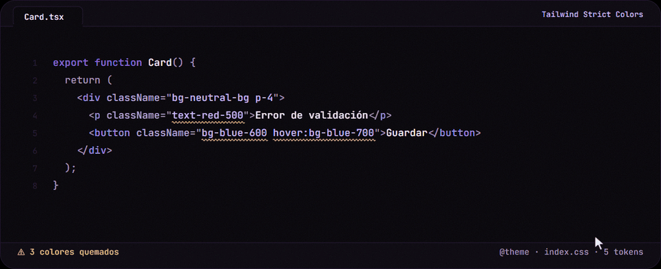

# Tailwind Strict Colors

[](https://github.com/JJBeta-Dev/tailwind-strict-colors/actions/workflows/ci.yml)
[](LICENSE)

<p align="center">
  
</p>

**Instalar:** descarga el `.vsix` desde [Releases](https://github.com/JJBeta-Dev/tailwind-strict-colors/releases/latest) y en VS Code / Antigravity: _Extensions_ → `...` → _Install from VSIX..._

Extensión para editores basados en VS Code (Antigravity incluido) que detecta
clases de Tailwind CSS que usan un color de la **paleta default** (`bg-red-500`,
`text-gray-200`, `border-white`, ...) en vez de un token definido en tu propio
`@theme` (Tailwind v4), y ofrece un Quick Fix para reemplazarlo.

No depende de ESLint ni de ningún archivo de configuración en la raíz del
proyecto: lee directamente el `@theme` de tu CSS.

## Cómo funciona

1. Busca el archivo CSS de tu workspace que hace match con
   `tailwindStrictColors.themeFileGlob` (por defecto `**/index.css`) y extrae
   todas las declaraciones `--color-*` dentro de sus bloques `@theme`.
2. Escanea los archivos abiertos (`tailwindStrictColors.languages`) buscando
   utilidades de color (`bg-`, `text-`, `border-`, `ring-`, `fill-`, ...) que
   apunten a la paleta default de Tailwind y **no** estén declaradas como tuyas.
3. Marca cada ocurrencia como advertencia en el panel _Problems_ y en el
   editor (subrayado ondulado amarillo).
4. Ofrece varias formas de corregirlo:
   - **Quick Fix** (💡) con hasta N sugerencias (`maxSuggestions`).
   - **Hover**: al pasar el mouse sobre la clase quemada aparecen las
     sugerencias con un swatch de color y un link para aplicar el reemplazo.
   - **Fix All** (comando de paleta o botón 🪄 del panel lateral): reemplaza
     todos los colores quemados del archivo actual o de todo el workspace.
   - **Panel lateral** ("Tailwind Strict Colors" en la Activity Bar): escanea
     todo el proyecto y lista los hallazgos agrupados por archivo, con
     buscador y click-to-jump.

   Las sugerencias se ordenan por cercanía de color real cuando se puede
   resolver el valor (`hex`/`rgb`/`var()` a hex/rgb), o por coincidencia
   semántica (`danger`, `warning`, `success`, `neutral`, ...) cuando el valor
   usa `oklch()`/`color-mix()` u otra función que no resolvemos.

Como Tailwind v4 genera automáticamente la utilidad `bg-<nombre>` a partir de
cada `--color-<nombre>` en tu `@theme`, el fix es literal: cambia el sufijo de
color de la clase por el nombre de tu token.

## Instalación local (modo desarrollo)

```bash
npm install
npm run build
```

Scripts disponibles:

| Script                 | Qué hace                                                        |
| ---------------------- | --------------------------------------------------------------- |
| `npm run build`        | Bundlea la extensión con esbuild → `dist/extension.js`.         |
| `npm run watch`        | Igual, en modo watch (útil con `F5`).                           |
| `npm run typecheck`    | `tsc --noEmit`.                                                 |
| `npm test`             | Unit tests (`node:test`) de la lógica pura.                     |
| `npm run lint`         | ESLint, incluida la validación de sintaxis TSDoc.               |
| `npm run format`       | Formatea todo el repo con Prettier.                             |
| `npm run format:check` | Verifica formato sin escribir (lo que corre en CI).             |
| `npm run verify`       | Corre typecheck + lint + format:check + test + build, en orden. |

CI (GitHub Actions, `.github/workflows/ci.yml`) corre `verify` + empaqueta un
`.vsix` en cada push/PR.

Luego, en Antigravity/VS Code:

1. Abre esta carpeta (`tailwind-strict-colors`) como workspace.
2. Presiona `F5` (o _Run Extension_ en el panel de Run & Debug).
3. Se abre una segunda ventana ("Extension Development Host") con la carpeta
   `example/` cargada — ahí ya hay clases quemadas de ejemplo en `Card.tsx`
   para probar la detección y el Quick Fix.

## Empaquetar un `.vsix` instalable

```bash
npx @vscode/vsce package
```

Genera `tailwind-strict-colors-0.1.0.vsix`. En Antigravity: _Extensions_ →
`...` → _Install from VSIX..._.

## Configuración (`settings.json`)

| Setting                                  | Default                                       | Descripción                                     |
| ---------------------------------------- | --------------------------------------------- | ----------------------------------------------- |
| `tailwindStrictColors.enable`            | `true`                                        | Activa/desactiva la extensión.                  |
| `tailwindStrictColors.themeFileGlob`     | `"**/index.css"`                              | Glob para encontrar tu archivo con `@theme`.    |
| `tailwindStrictColors.languages`         | jsx/tsx/html/vue/svelte/astro                 | Lenguajes donde se escanean clases.             |
| `tailwindStrictColors.utilities`         | `bg`, `text`, `border`, `ring`, ...           | Prefijos de utilidades a inspeccionar.          |
| `tailwindStrictColors.ignoredColorNames` | `inherit, current, transparent, black, white` | Nombres "bare" (sin shade) que nunca se marcan. |
| `tailwindStrictColors.maxSuggestions`    | `5`                                           | Máximo de sugerencias en el Quick Fix.          |

## Estructura del proyecto

```
src/
  extension.ts             activate/deactivate, conecta todas las piezas
  config.ts                 lectura de settings de VS Code
  tailwindPalette.ts         paleta default de Tailwind (familias, shades, hex, sinónimos)
  cssThemeParser.ts          parser de bloques @theme -> tokens --color-*
  themeWatcher.ts            localiza y observa el/los CSS del theme por workspace
  colorScanner.ts            motor de detección (regex + validación contra tokens)
  colorDistance.ts           ranking de sugerencias (distancia de color / sinónimos)
  autoFix.ts                 calcula los reemplazos para Fix All
  generatedFileHeuristic.ts  descarta bundles minificados del escaneo de workspace
  workspaceScan.ts           descubre archivos del proyecto y corre el scanner sobre cada uno
  diagnostics.ts             DiagnosticCollection (panel Problems)
  codeActionProvider.ts      Quick Fix / Fix All (Source Action)
  hoverProvider.ts           tooltip con sugerencias al pasar el mouse
  fixAllCommands.ts          comandos de paleta: reemplazar todo (archivo/workspace)
  problemsWebviewProvider.ts panel de la Activity Bar (webview)
  test/                      unit tests (node:test) de la lógica pura
media/                    CSS/JS del webview, codicons, íconos
example/                  mini-proyecto usado para probar con F5
```

Ver `CLAUDE.md` para el detalle de arquitectura, flujo de datos y el porqué
de las decisiones no obvias.

## Limitaciones conocidas (v1)

- Solo resuelve a color real valores `#hex`, `rgb()/rgba()` y cadenas de
  `var()` entre sí. Si tu token usa `oklch()`, `hsl()` o `color-mix()`, el
  Quick Fix igual aparece pero ordenado por sinónimo semántico, no por
  distancia de color real.
- La detección es por regex sobre el texto del documento (no un parser real
  de JSX/Vue/Svelte), igual que hace Tailwind IntelliSense; cubre `className`,
  `class`, `clsx()`, `cva()`, etc. porque no depende de la sintaxis del
  lenguaje, solo del patrón `utilidad-color-shade`.
